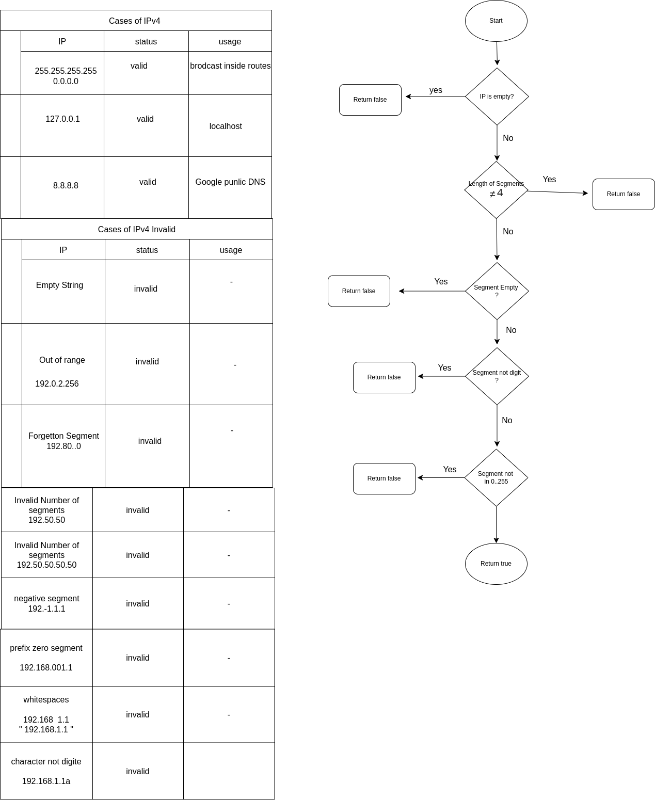

# IPv4 Address Validator

This project is a simple **IPv4 address validator** written in **Kotlin**. It checks if an input string follows the standard IPv4 format.

## Conditions 
- Ensures the IP address has **exactly 4 segments**.
- Each segment must be a **numeric value** between `0` and `255`.
- Prevents segments from **starting with a zero** (unless it's "0").
- Rejects inputs with **invalid characters or spaces**.

## Flowchart
Below is a flowchart illustrating the validation logic:

