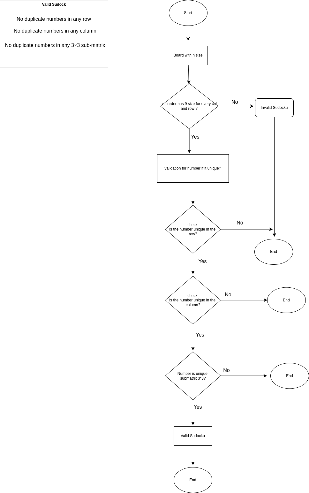

### Sudoku Validator

This project contains a Sudoku board validator in Kotlin.
The validator checks whether a given 9x9 Sudoku board follows the necessary rules to be considered a valid Sudoku puzzle.

## Flowchart
Below is a flowchart illustrating the validation logic:

